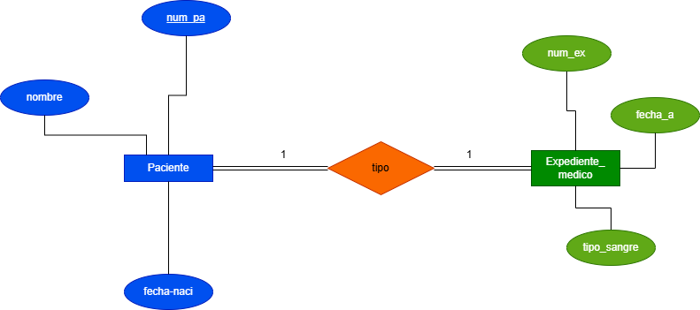
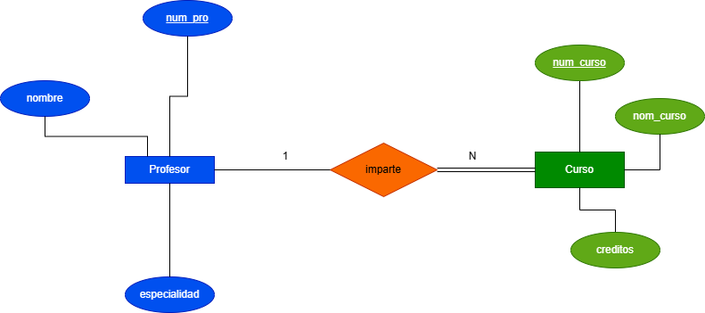
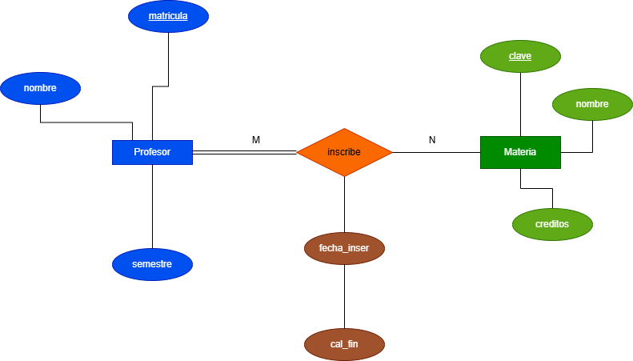

# ejercicios del Modelo E-R 

## Ejercicio 1

un hospital rejistra informacion de sus pacientes:
> De cada paciente se almacena:
- numero de paciente que lo identifica
- Nombre 
- Fecha de nacimiento 
> de cada expediente Medico se almacena:
- numero de expediente 
- fecha de apertura 
- Tipo de sangre 
> reglas del negosio
1. cada paciente debe tener un expediente medico 
2. cada expediente medico pertenece a un unico paciente 
3. no puede existir un expediente sin paciente 
4. no puedee existir un paciente si expediente 

> que se debe realizar:
- Identificar las entidades  
- identificar los atributos
- Dibujar las relaciones 
- Determinar la cardinalidad 
- determinar la participacion de cada entidad

## ejercicio 2
una universidad administra profesores y cursos
> cada profesor se almacena :

- Numero de profesor
- Nombre 
- especialidad

> de cada **curso**  se almacena :

- Numero de curso 
- Nombre del curso
- Creditós

> regla del negosio
1. Un profesor puede impartir varios cursos
2. Pn curso solamente puede ser impartido por un profesor
3. Puede existir un profesor que no imparta cursos
4. Todos los cursos debe estar asignado a un profesor

## Ejercicio 3 
Una escuela administra alumnos y materias 

> de cada **alumno** se almacena:

- matricula 
- nombre 
- semestre 

> de cada **Materia** se almacena:

- Clave de la materia 
- Nombre de la materia 
- Creditos

> reglas del negosio
1. Un alumno puede inscribirse en barias materias 
2. Una materia puede tener muchos alumnos inscrito 
3. Puede existir una materia sin alumnos inscritos 
4. Todo alumnos debe estar inscrito en almenos una materia
5. De cada incripcion se almacena:
    - Fecha de incripcion
    - Calificacion Final 
Nota: a la relacion nombrela **INSCRIBE**

## Ejercicio 4 
una empresa dedicada a las ventas al por mayor necesita registrar los siguientes:
> para los clientes  
- Numero de cliente 
- Nombre (el cual es una persona moral)

> pedido 
- Numero del pedido
- fecha del pedido 

> producto 
- numero de producto 
- nombre 
- precio 
> reglas del negosio 
1. un cliente puede realizar muchos pedido
2. cada pedido pertenece a un solo cliente 
3. un pedido  contiemne varios producto 
4. un producto puede aparecer en muchos pedidos 
5. un pedido debe contener al menos un producto 
6. un producto puede no haber sido vendido
7. el detalle del pedido no existe sin pedido
8. el detalle del pedido no existe sin producto 
9. el detalle almacena la cantidad vendida y el precio de venta

